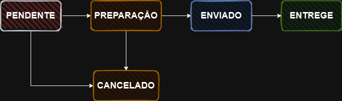

# Case Técnico

Este repositório contém o back-end desenvolvido utilizando Spring Framework para atender aos requisitos do desafio.

## Sumário

## Como Executar o projeto

O arquivo [docker-compose.yml](/docker-compose.yml) contem as declarações e configurações para disponibilizar uma instancia do banco de dados MySql, bastar executar o comando.

> [!WARNING]
> Antes de iniciar a aplicação realize a criação das tabelas (DDL) e adição do registros (DML) importando o arquivo [dump.sql](./dump.sql).

```bash
docker-compose.yml
```

> [!NOTE]
> Tambem é possivel utilizar o banco de dados configurado localmente

As configurações de conexão com o banco de dados podem ser definidas nas seguintes variaveis de ambiente:

- SPRING_DATASOURCE_URL: URL de conexão do banco de dados (padrão: jdbc:mysql://localhost:3306/e_commerce_db)
- SPRING_DATASOURCE_USERNAME (padrão: root)
- SPRING_DATASOURCE_PASSWORD (padrão: root)

> [!TIP]
> Ao executar os containers definidos no docker compose, nenhuma variável de ambiente precisa ser difinida, basta apenas executar a aplicação.

Para executar aplicação Api Ecommerce no diretório do modulo principal [./ecommerce/](./ecommerce/) execute:

```bash
.\mvnw spring-boot:run
```

## Modularização

O projeto esta divido em três modulos: 
 -  `security`
 -  `payment`  
 -  `ecommerce` 

afim de manter a coesão de código e manter as responsabilidades bem definidas.

## Autenticação Stateless
O método de autenticação utilizado no projeto é `stateless` com token JWT
no interior do token estão contidos as seguintes `claims`:

- id: identificar o usuario.
- role: verificar quais recursos podem ser acessados. 

## Otimizações no Banco de Dados

Foram feitas as otimizações afim de obter melhor performance no processamento das requisições.

- Tipo do campo Id (UUID) das tabelas definido para BINARY(16).
  - Ocupa menos espaço em disco.
  - Necessita de menos processamento para comparações.
- Utilizar indices para reduzir a quantidade de linhas lidas na tabelas pela clausula COUNT utilizando o campo id (COUNT(p.id)).
    ```xml
    <query>
        <![CDATA[
            SELECT u.id AS id, u.nome AS nome, u.email AS email, COUNT(p.id) AS totalPedidos
            FROM pedido p
            JOIN usuario u ON p.usuario_id = u.id
            GROUP BY u.id
            ORDER BY totalPedidos DESC
            LIMIT :quantidade
        ]]>
    </query>
    ```
- Uso de JOIN FETCH para unificar tabelas evitando N+1 Queries.
- Criação de Indices para os campo mais utilizados para pesquisa.

    ```java
    @Entity
    @Table(name = "usuario", indexes = {@Index(name = "idx_usuario_email", columnList = "email")})
    public class Usuario extends Identity<UUID> { ... }
    ```

    ```java
    @Entity
    @Table(indexes = {
            @Index(name = "idx_pedido_usuario", columnList = "usuario_id"),
            @Index(name = "idx_created_at", columnList = "createdAt")
    })
    @Getter
    @Setter
    public class Pedido extends AuditableEntity<UUID> { ... }
    ```
## Modulo Para Reutilização de Código
A aplicação possui o módulo para reutilização de código e implementação dos padrões de projeto [Strategy](https://refactoring.guru/design-patterns/strategy) e [Template Method](https://refactoring.guru/design-patterns/template-method).

 #### O Módulo oferece suporte para:
- Desenvolvimento de Arquitetura Hexagonal Limpa (Clean Code, KISS).
- Implementação de CRUD com reutilização de código (foco no desenvolvimento das regras de negócio).
- Geração de documentação automática utilizando Swagger.
- Configuração automática para gerenciamento de exceptions e formatação para [RFC7807](https://datatracker.ietf.org/doc/html/rfc7807) (Norma para padronização de retorno de erros em Rest Apis).

> [!IMPORTANT]
> A documentação do módulo foi desenvolvida utilizando Quarkus, porém, os exemplos são aplicados de forma similar no Spring. Esta pode ser encontrada em [Trajy/Quarkus Base Architecture](https://github.com/Trajy/Quarkus-Base-Architecture?tab=readme-ov-file#quarkus-base-architecture).

O módulo está no repositório [Trajy/Spring-Base-Architecture](https://github.com/Trajy/Spring-Api-Architecture) e foi adicionado ao projeto utilizando Maven como gerenciador de dependências.

```xml
    <repositories>
            <repository>
                <id>jitpack.io</id>
                <url>https://jitpack.io</url>
            </repository>
    </repositories>

    <dependencies>
        <dependency>
            <groupId>com.github.Trajy</groupId>
            <artifactId>Spring-Api-Architecture</artifactId>
            <version>main-SNAPSHOT</version>
        </dependency>
    </dependencies>
```

> [!IMPORTANT]
> O desenvolvedor pode focar no desenvolvimento das regras de negócio.

## Tratamento de Erros
A configuração do gerenciador de exceptions pode ser feita de forma simples:

```Java

import br.com.trajy.architecture.restful.exception.RestGlobalExecptionHandler;

@Import({
        RestGlobalExecptionHandler.class //Configura o gerenciador de exceptions
})
@Configuration
public class AutoConfigurations {

}
```

Exemplo de resposta de erro conforme o padrão [RFC7807](https://datatracker.ietf.org/doc/html/rfc7807):

```json
{
    "status": "401",
    "type": "/usuario/auth",
    "detail": "Usuário inexistente ou senha inválida."
}
```

## Regras de Negócio

A transição entre os status do pedido foi desenvolvida utilizando o Design Pattern [Strategy](https://refactoring.guru/design-patterns/strategy). Com essa abordagem é possivel controlar quais as alterações possiveis:



> [!NOTE]
> Se houver a tentativa de alterar o status de `ENVIADO` para `CANCELADO` a operação não será permitida. De forma análoga demais alterações no status que não atendam o fluxo no diagrama não serão permitidas.


